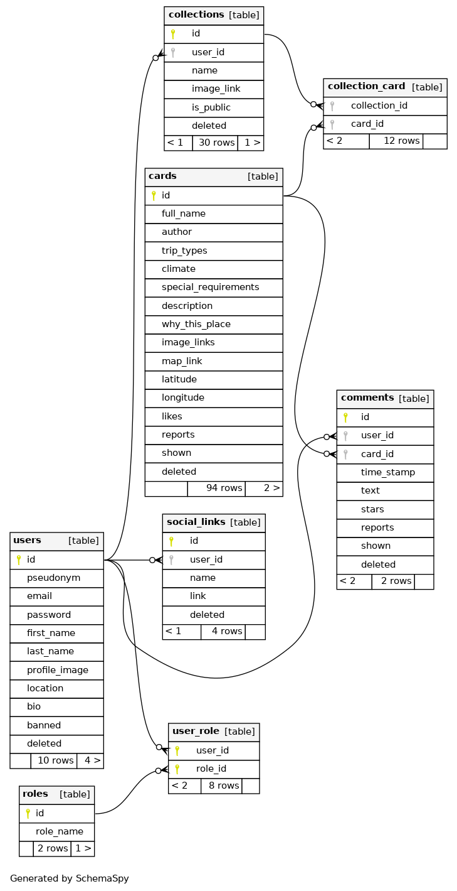

# Wander Wise
Welcome to **Wander Wise** — ultimate travel companion for discovering and organizing travel destinations! This AI powered project helps users to explore locations through various filters, save and organize these locations, and interact with the community. Whether the locations are fetched from our database or generated by AI, Wander Wise aims to enhance user's travel planning experience.

## Table of Contents

1. [The Inspiration](#the-inspiration)
2. [Technologies and Tools Used](#technologies-and-tools-used)
3. [Project Functionalities](#project-functionalities)
4. [Database structure](#database-structure)
5. [Setup and Usage](#setup-and-usage)
6. [Postman Collection](#postman-collection)
7. [Challenges and Solutions](#challenges-and-solutions)

## The Inspiration
At its core, Wander Wise was conceived to address the limitations of conventional travel platforms. We recognized that existing tools often lead travelers to well-trodden paths, missing the hidden gems that lie just off the beaten track.

### The Problem It Solves
1. **Simplicity of Use:** Many people hesitate to travel independently due to the time-consuming planning process. Wander Wise allows users to apply filters and receive tailored travel suggestions with just a few clicks. Less planning, more travel!
2. **New experience:** Every country, city, and even small town boasts hundreds of fascinating places. Unfortunately, only the most well-known destinations tend to be discovered by travelers. Wander Wise offers locations that popular travel lists often overlook.
3. **Global Reach, Local Insights:** How often do people yearn to “go somewhere” on weekends? Just hop in a car to explore destinations within few hours of ride. Wander Wise offers this opportunity along with discovering far-flung locations across the globe.
4. **Community:** It is often hard to find a good company for the trip. Wander Wise isn’t just an app; it’s a community of explorers. Users can create own locations, add cards to Saved, create custom collections, and plan trips collaboratively. 

The combination of features in Wander Wise opens up exciting possibilities. It could indeed evolve into a global social network for both experienced travelers and those seeking interesting vacations. Imagine a platform where users share their travel experiences, tips, and hidden gems from around the world.

## Technologies and Tools Used
The project leverages a robust stack of technologies to ensure scalability, security, and performance:

- **Spring Boot**
- **Spring Data JPA**
- **Spring Validation**
- **Spring Web**
- **Spring Test**
- **Spring AI OpenAI**
- **Spring WebMVC UI (Swagger)**
- **Spring Security**
- **Spring Mail**
- **Spring Cloud AWS**
- **MySQL**
- **Hibernate**
- **Liquibase**
- **JUnit**
- **Testcontainers**
- **Lombok**
- **MapStruct**
- **Spring Configuration Processor**
- **JWT**
- **Maven**
- **AWS (EC2, RDS, ECR, S3)**

## Project Functionalities
There is the whole list of endpoints with detailed description: http://3.91.160.29:8088/api/swagger-ui/index.html

Here are provided only short descriptions for each controller.

### User Management Endpoints
- Update user roles, password, information, profile image, and email.
- Retrieve user social links, profile, comments, and collections.
- Ban or unban users.
- Delete user accounts.

### Social Links Management Endpoints
- Update, delete, or add social links.

### Comment Management Endpoints
- Update, delete, report, or post comments on cards.

### Collection Management Endpoints
- Find, update, delete, or create collections of cards.

### Card Management Endpoints
- Update, report, like/unlike, save/remove from saved cards.
- Add images to cards, create new cards, search for cards.
- Hide/reveal cards, retrieve card details.
- Delete cards.

### Authentication Endpoints
- Restore password, register, login, confirm email, refresh JWT, logout.

## Database structure
Here is the comprehensive model of the actual project db structure.

## Setup and Usage
To set up and run Wander Wise locally, follow these steps:

### Prerequisites
- JDK 11 or higher
- Maven
- MySQL
- AWS account with necessary permissions
- APIs: OpenAI, AWS, Google Cloud, Azure
- Gmail SMTP credentials (for sending util emails)
- Docker (optionally)
- Postman

### Set-up process 
#### Using IDE
1. Install all required tools. 
2. Rename .env.sample file to .env and fill it with required data.
3. Run `mvn clean package` command to build the project.
4. Run project. Open this link to check if project works: http://localhost:8080/api/swagger-ui.html

#### Using Docker
1. Follow first 3 steps from previous guide. 
2. After the project has been built, run `docker-compose build` to create a project image. 
3. Run `docker-compose up`. If everything ok, Docker should automatically pull the latest image of mysql and run the project.
4. Open this link to check if project works: http://localhost:<SPRING_LOCAL_PORT>/api/swagger-ui.html (provide here variable, that you used in .env file).

## Postman Collection
A Postman collection is provided to simplify the interaction with Wander Wise APIs. Download and import the collection into Postman:

### [Postman Collection](https://elements.getpostman.com/redirect?entityId=29603624-db52d44b-08ee-454e-ac46-43b2e959361c&entityType=collection)

## Challenges and Solutions
**Challenge:** Ensuring secure user authentication and authorization.\
**Solution:** Implemented Spring Security with JWT for robust authentication and authorization mechanisms. 

**Challenge:** Managing database migrations smoothly.\
**Solution:** Utilized Liquibase for efficient and reliable database version control.

**Challenge:** Integrating AI for generating travel locations.\
**Solution:** There was a serious problems with AI responses quality: duplicates, unexisting locations, etc. The huge amount of time was spent on creating reliable process of generating and validating location cards. Right now this process includes more than 10 steps with several layers of validation.

**Challenge:** Implementing convenient and robust interconnections between different entities and features.\
**Solution:** Creating visual model of backend architecture, adjusting all parts of the applications with business logic. Several reviews were done to ensure, that all functions work as they should.

## Conclusion
By addressing common pain points in travel planning, such as the overwhelming amount of information and the difficulty in discovering unique destinations, Wander Wise makes the process of exploring new places simpler and more enjoyable.

With its combination of user-friendly features, comprehensive travel suggestions, and community-driven content, the platform not only helps users plan their trips efficiently but also fosters a vibrant community of travel enthusiasts sharing their insights and experiences.

In conclusion, Wander Wise is more than just a travel app; it is a dynamic tool that leverages advanced technologies and community engagement to redefine how people discover and plan their travels. The inclusion of AI-powered suggestions and a strong community element enriches the user experience, making travel planning more personalized and interactive.

Whether you're seeking a weekend getaway or an exotic adventure, Wander Wise is designed to help you uncover hidden gems and create memorable journeys with ease.
